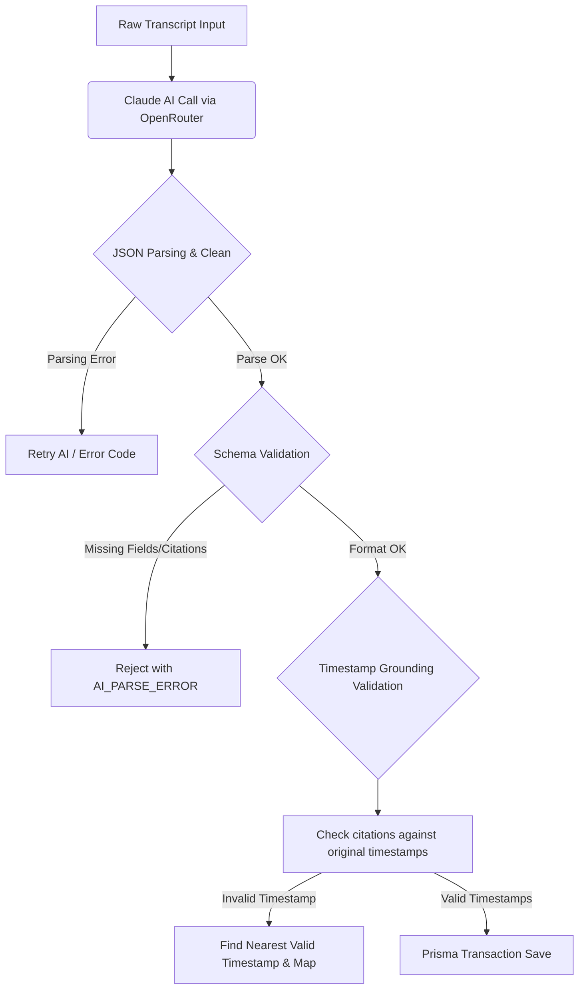

# AI Engineering & Grounding Strategy

This document details the system prompt engineering, hallucination prevention, citation strategy, validation mechanisms, and known limitations of the artificial intelligence layers in the Meeting Intelligence Service.

---

## Prompt Design & System Grounding

The AI features use structured instructions designed to prevent hallucinations by restricting the model's domain of information. The prompt strategy split is as follows:

### System Prompt (Contextual Grounding & Constraints)
The system prompt establishes the persona of a meeting analyst operating under strict truthfulness constraints. It forces the model to restrict its scope to the provided transcript:
- **Absolute Grounding**: The prompt instructs: *"You are a meeting analyst that ONLY uses information explicitly present in the transcript. NEVER invent, assume, or add information not explicitly stated..."*
- **No Uncited Statements**: Every claim or insight must have a traceable citation source.
- **Strict Format Enclosure**: Instructions demand that only a raw JSON string be returned, banning markdown wrappers (like code fences) or pre-/post-text explanations.

### User Prompt (Data Input & Structured Schema)
The user prompt provides the structured transcript and outlines the expected output JSON structure:
- **Transcript Context**: Formats the transcript in a sequential structure: `[timestamp] Speaker: text`.
- **Target Schema Enforcement**: Specifies an exact JSON format containing:
  - `summary`: High-level points discussed.
  - `decisions`: Explicit agreements.
  - `actionItems`: Tasks, assignees, and due dates.
  - `followUpSuggestions`: Next steps.
- **Citation Requirement**: Forces the model to attach a citation array of `[timestamp, speaker, quote]` to every element.

---

## Citation Strategy

To ensure auditable insights, the system requires a 3-part citation structure (triplet) for each item:

1. **Timestamp (`MM:SS` or `HH:MM:SS`)**: The exact point in the timeline where the speaker made the statement.
2. **Speaker**: The name of the participant who made the statement.
3. **Quote**: A brief, direct verbatim quotation of the statement from the transcript.

### Example Citation JSON Structure
```json
{
  "timestamp": "01:30",
  "speaker": "Jane Doe",
  "quote": "I will finish the auth module by tomorrow morning."
}
```
Citations are saved directly alongside the analysis records and action items in PostgreSQL, allowing clients to show tooltip proofs or jump directly to the relevant moment in an audio/video player.

---

## Hallucination Prevention & Validation Flow

To enforce truthfulness and schema validity, the backend runs the output through a rigorous multi-tier verification pipeline:



### 1. JSON Cleansing & Safe Parsing
Often, LLMs wrap JSON inside markdown blocks (e.g., ` ```json ... ``` `). The system cleans these tags before parsing:
```javascript
const cleanJson = responseText.replace(/```json|```/gi, '').trim();
const parsedData = JSON.parse(cleanJson);
```

### 2. Structural Shape Validation
The backend verifies that the parsed data contains the required output arrays (`summary`, `decisions`, `actionItems`, `followUpSuggestions`). If these are missing or are not arrays, the transaction fails immediately.

### 3. Citation Completeness Check
Every item is scanned to ensure it contains a non-empty `citations` array. Every citation must possess a non-empty `timestamp`, `speaker`, and `quote` attribute. If a citation is missing critical details, it is thrown out.

### 4. Post-Generation Timestamp Alignment (Grounding)
If the model outputs a timestamp that does not exist in the transcript (a common LLM hallucination due to token sequence bias), the system detects it and uses an algorithm to locate the closest actual transcript timestamp based on time distance:
```javascript
function findNearestTimestamp(target, validList) {
  // Calculates nearest valid timestamp from the transcript
}
```
This guarantees that all citations map back to actual lines in the database.

---

## Known Limitations

1. **Sparse Transcripts**: If a meeting transcript is very short or contains little substance, the AI may return empty arrays or very few insights.
2. **Context Window / Token Limits**: While Claude handles massive inputs, extremely long transcripts (e.g., 4+ hour meetings) might exceed token limits or increase token consumption fees significantly.
3. **Due Date Parsing**: Assigning a `dueDate` to an action item is performed by the AI based on free-form speech context (e.g., *"by next Monday"* or *"by June 10th"*). The extraction and conversion to an ISO 8601 string is done on a best-effort basis and might mismatch if the speaker is ambiguous.
4. **Speaker Attribution**: The AI relies entirely on the correctness of the speaker tag in the transcript. If the transcription software misattributes a speaker, the AI's citations will inherit the error.
